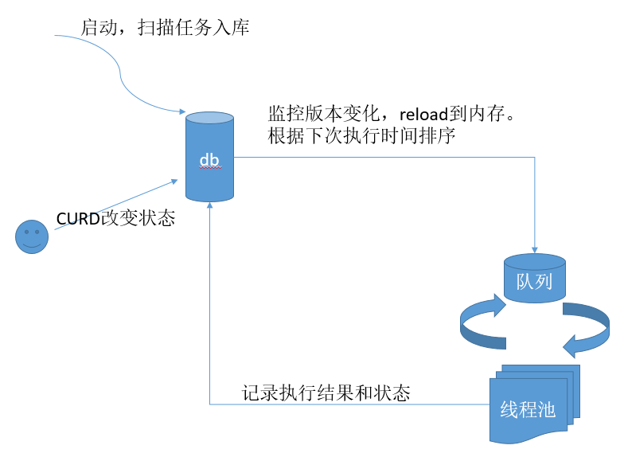

# django-background-job

include all features of apscheduler and django-apscheduler, but more than that:

- delayed job
- cron
- interval until
- once  at
- distributed deploy with etcd
- less db pressure

## arch

## references

- [django-background-task](https://github.com/lilspikey/django-background-task)
- [cron trigger](https://apscheduler.readthedocs.io/en/stable/modules/triggers/cron.html)
- [once trigger](https://apscheduler.readthedocs.io/en/stable/modules/triggers/date.html#module-apscheduler.triggers.date)
- [interval interval](https://apscheduler.readthedocs.io/en/stable/modules/triggers/interval.html#module-apscheduler.triggers.interval)
- [django-apscheduler](https://github.com/drunkpig/django-apscheduler-ng)

## known issues
1. interval-job 中暂不支持 start_time~end_time区间执行。暂时没遇到这种情况
2. interval-job,cron-job的 start_immediately 暂不支持
3. 

## TODO
- 线程池
- misfire_grace_time
- 合并执行
- 并行度
- 异常
